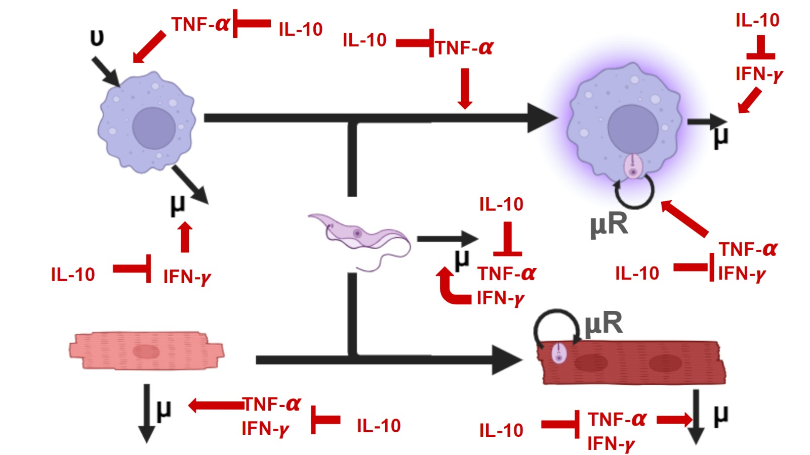

# Primer modelo

1.-$$ d{T_{L}} = \alpha_{1} T_{L} - \alpha_{2} T_{L}M_{\phi} - \alpha_{3}T_{L}C_{N} - \mu T_{L} $$

2.-$$ dT_{i} = \alpha_{2}T_{L}M_{\phi} + \alpha_{3}T_{L}C_{N} - \alpha_{4}M_{\phi}iT_{i}-\alpha_{5}M_{\phi}iCD8 - \alpha_{6}C_{i}CD8 - \mu T_{i} + \alpha_{9}T_{i} $$

3.-$$ dM_{\phi} = \alpha_{7}M_{\phi} - \alpha_{2}T_{L}M_{\phi} - \mu M_{\phi} $$

4-.$$ dM_{\phi}i = \alpha_{2}T_{L}M_{\phi} - \alpha_{5}M_{\phi}iCD8 -\mu M_{\phi}i $$

5.-$$ dC_{N}= \alpha_{8}C_{N} - \alpha_{3}T_{L}C_{N} - \mu C_{N} $$

6.-$$ dC_{i} = \alpha_{3}T_{L}C_{N} - \alpha_{6}C_{i}CD8 - \mu C_{i} $$

7.- $$ dCD8 = \alpha_{10} CD8 - \mu CD8 $$

## Explicacion

### Primera. Parasitos libres

$$ +\alpha_{1} T_{L}  $$ hace referencia a la entrada de protozoarios a
el huesped o al sistema. Sin embargo no debe de multiplicarse por que no
depende de los parasitos iniciales que haya o no dentro del huesped.
Estos parasitos son libres, no esta de manera intracelular
$$ -\alpha_{2} T_{L}M_{\phi} $$ Es la interaccion del parasito con los
macrofagos, que son fagocitados, por lo que dejan de ser parasitos
libres $$ -\alpha_{3}T_{L}C_{N} $$ La interaccion del parasito con los
cardiomiocitos, el parasito ingresa al citoplasma del cardiomiocito para
su replicacion, por lo que se vuelve parasito intracelular
$$-\mu T_{L}$$ La muerte natural del parasito libre

### Segunda ecuacion. Parasitos intracelulares

$$\alpha_{2}T_{L}M_{\phi} $$ Es la interaccion de parasitos que son
fagocitados por los macrofagos pero se vuelven intracelulares (pueden
escapar del fagolisosoma y dividirse) $$+ \alpha_{3}T_{L}C_{N}$$ El
parasito al interactuar con los cardiomiocitos, lo penetra para
establecerse en el citoplasma y pasar a amastigote, por lo que se
convierte en parasito intracelular

$$- \alpha_{4}M_{\phi}iT_{i}$$ Cuando un protozoario libre es fagocitado
puede escapar del fagolisosoma o puede ser eliminado por medio de
especies reactivas del macrofago, esto representa la ecuacion

$$-\alpha_{5}M_{\phi}iCD8$$ Es la interaccion de los macrofagos
infectados que tienen parasitos intracelulares y son eliminados por
accion de las linfocitos CD8 citoliticos

$$-\alpha_{6}C_{i}CD8$$ Es la interaccion de los cardiomiocitos
infectados que son eliminados por los linfocitos CD8+ citotoxico

$$ - \mu T_{i} $$ Representa la muerte natural del parasito dentro de
las celulas

$$+\alpha_{9}T_{i} $$ Representa la proliferacion que tiene el parasito
cuando se encuentra en el citplasma en forma de amastigote

### Tercera. Macrofagos

$$\alpha_{7}M_{\phi} $$ Implica la proliferacion de los macrofagos,
debido a que no dependen de los que ya estan presentes, solo se debe
dejar la tasa de crecimiento, se producen en medula osea

$$-\alpha_{2}T_{L}M_{\phi}$$ La interaccion de macrofagos con el
protozoario, por lo que el macrofago se vuelve en un macrofago infectado

$$\mu M_{\phi} $$ Es la muerte natural del macrofago en condiciones
naturales

### Cuarta. Macrofagos infectados (Mejor poner f de que fagocitaron)

.$$\alpha_{2}T_{L}M_{\phi}  $$ Es la interaccion del parasito libre con
los macrofagos, por lo que es fagocitado e internalizado

.$$- \alpha_{5}M_{\phi}iCD8$$ La eliminacion de los macrofafos que
fagocitaron por medio de los linfocitos CD8

.$$-\mu M_{\phi}i $$ Muerte especifica del macrofago infectado por el
parasito

### Quinta. Cardiomiocitos

$$ \alpha_{8}C_{N} $$ La proliferacion de cardiomiocitos, SE REQUIERE
BUSCAR SI PROLIFERAN POR SI MISMOS O SU TAZA SE REPLICACION

$$- \alpha_{3}T_{L}C_{N}$$ La interaccion de los parasitos libres que
infectan a los cardiomiocitos para su replicacion en el citoplasma

$$ - \mu C_{N} $$ La muerte natural del cardiomiocito

### Sexta. Cardiomiocitos infectados

$$ \alpha_{3}T_{L}C_{N} $$ La interaccion con la que el parasito logra
infectar a los cardiomiocitos, esto depende de la cepa y el tropismo

$$ - \alpha_{6}C_{i}CD8 $$ Los cardiomiocitos infectados por el parasito
son eliminados por medio de los linfocitos CD8 citotoxicos

$$- \mu C_{i} $$ Muerte de los cardiomiocitos cuando se encuentran
infectados con el parasito

## Citocinas implementadas

-IL-12 ayuda a la diferenciacion de respuesta Th1 de los linfocitos, por
lo que generan una produccion de IFN-gamma para eliminar a los parasitos
intracelulares

-IL-10 la citocina antiinflamatoria por defecto, capaz de suprimir la
produccion de IFN-gamma generando una mayor tolerancia a el parasito
para evitar algun dano al tejido o cardiomiocitos

-TNF-alpha citocina proinflamatoria que se activa inicialmente al
momento que los macrofagos son capaces de detectar al parasito por medio
de sus TLR.

-TGF-beta citocina antiinflamatoria junto con IL-10

-IFN-gamma, citocina proinflamatoria producida por los linfocito CD4 que
activan a los macrofagos para aumentar su eficiencia en eliminar al
parasito fagocitado, se da cuanto hay una respuesta Th1, se suprime con
la presencia de IL-10

Las citocinas tienen una compleja dinamica de regulacion

Pero las citocinas regulan interacciones, e igual al cambiar de fase o
desarrollo de la enfermedad pueden cambiar proporciones

## Modelo de Staphylococcus aureus (Citocinas)

Ponene el efecto de las citocinas como:

$$ H_{Y}^U(x)= \dfrac{X^{h}}{\eta ^{h}rx + X^{h}} $$
$$ H_{Y}^{D}(X)= \dfrac{\eta ^{h}YX}{\eta ^{h}rx + x^{h}} $$

El superindice de H representa la funcion de cada citocina, cuando esta
la U, implica una UP-regulation y la D es de DOWN-regulation. X
representa la citocina que afecta a la citocina Y.

Half maximum value by $\eta$

### Activacion de macrofagos por Staphylococcus aureus


Estan los efectos de las citocinas que impactan a el parametro
$K_{MTNF}$ que es: Activation rate of resting macrophages influenced by
TNF-α

El factor $\gamma _{MA}$ es el factor de represents macrophage
activation at the rate γMA in response to the bacteria

TODO JUNTO: represents macrophage activation at the rate γMA in response
to the bacteria and activation rate kMTNF considering the influence of
the cytokines TNF and IL-10.

# Segundo Modelo (Con citocinas)

Se implementara la misma funcion de citocinas como en el modelo de
Staphylococcus aureus.

1.-$$ d{T_{L}} = \alpha_{1} T_{L} - (\alpha_{2} H_{M}^U(TNF)H_{M}^D(IL10)) T_{L}M_{\phi} - \alpha_{3}T_{L}C_{N} - \mu_{1} T_{L} $$

2.-$$ dT_{i} = (\alpha_{2} H_{M}^{U}(TNF)H_{M}^{D}(IL10)) T_{L}M_{\phi} + \alpha_{3}T_{L}C_{N} - (\alpha_{4}H_{M}^{U}(TNF)H_{M}^{U}(IFN)H_{M}^{D}(IL10) )M_{\phi}iT_{i}$$
$$-(\alpha_{5}H_{CD8}^{U}H_{CD8}^{D}(IL10))M_{\phi}iCD8 - (\alpha_{6}H_{CD8}^{U}(TNF)H_{CD8}^{U}(IFN)H_{CD8}^{D}(IL10))C_{i}CD8 - \mu_{2} T_{i} + \alpha_{9}T_{i} $$

3.-$$ dM_{\phi} = \alpha_{7}M_{\phi} - (\alpha_{2}H_{M}^{U}(TNF)H_{M}^{D}(IL10) )T_{L}M_{\phi} - \mu_{3} M_{\phi} $$

4-.$$ dM_{\phi}i = (\alpha_{2}H_{M}^{U}(TNF)H_{M}^{D}(IL10))T_{L}M_{\phi} - (\alpha_{5} H_{CD8}^{U}(IFN)H_{CD8}^{D}(IL10))M_{\phi}iCD8 -\mu_{4} M_{\phi}i $$

5.-$$ dC_{N}= \alpha_{8}C_{N} - \alpha_{3}T_{L}C_{N} - \mu_{5} C_{N} $$

6.-$$ dC_{i} = \alpha_{3}T_{L}C_{N} - (\alpha_{6} H_{CD8}^{U}(TNF)H_{CD8}^{U}(IFN)H_{CD8}^{D}(IL10))C_{i}CD8 - \mu_{6} C_{i} $$

7.-
$$ dCD8 = (\alpha_{10}H_{CD8}^{U}(IFN)H_{CD8}^{D}(IL10)) CD8 - (\mu_{7}H_{CD8}^{D}(IFN)H_{CD8}^{U}(IL10) )CD8 $$

8.-
$$dTNF = (\alpha_{11}H_{TNF}^{D}(IL10))M_{\phi}i - \mu_{8}(TNF - qTNF)$$

9.- $$ dIFN = (\alpha_{12}H_{IFN}^{D}(IL10))- \mu_{9}(IFN-qIFN)  $$

10.- $$dIL10 = \alpha_{13} - \mu_{10}(IL10-qIL10)  $$

# Tercer Modelo (Citocinas y retardos de priliferacion)

1.-$$ \dot{T_{L}} = (\alpha_{1} + \mu C_{i} + \mu M_{\phi}i) T_{L} - (\alpha_{2} H_{M}^U(TNF)H_{M}^D(IL10)) T_{L}M_{\phi} - \alpha_{3}T_{L}C_{N} - \mu_{1} T_{L} $$

2.-$$ \dot{T_{i}} = (\alpha_{2} H_{M}^{U}(TNF)H_{M}^{D}(IL10)) T_{L}M_{\phi} + \alpha_{3}T_{L}C_{N} - (\alpha_{4}H_{M}^{U}(TNF)H_{M}^{U}(IFN)H_{M}^{D}(IL10) )M_{\phi}iT_{i}$$
$$-(\alpha_{5}H_{CD8}^{U}H_{CD8}^{D}(IL10))M_{\phi}iCD8 - (\alpha_{6}H_{CD8}^{U}(TNF)H_{CD8}^{U}(IFN)H_{CD8}^{D}(IL10))C_{i}CD8 - \mu_{2} T_{i} + \alpha_{9}T_{i}(C_{i}+M_{\phi}i) $$

3.-$$ \dot {M_{\phi}} = \alpha_{7}(M_{\phi}-M_{\phi}0) - (\alpha_{2}H_{M}^{U}(TNF)H_{M}^{D}(IL10) )T_{L}M_{\phi} - \mu_{3} M_{\phi} $$

4-.$$ \dot{M_{\phi}i} = (\alpha_{2}H_{M}^{U}(TNF)H_{M}^{D}(IL10))T_{L}M_{\phi} - (\alpha_{5} H_{CD8}^{U}(IFN)H_{CD8}^{D}(IL10))M_{\phi}iCD8 -\mu_{4} M_{\phi}i $$

5.-$$ \dot{C_{N}}= \alpha_{8}(C_{N}-C_{N}0) - \alpha_{3}T_{L}C_{N} - \mu_{5} C_{N} $$

6.-$$ \dot{C_{i}} = \alpha_{3}T_{L}C_{N} - (\alpha_{6} H_{CD8}^{U}(TNF)H_{CD8}^{U}(IFN)H_{CD8}^{D}(IL10))C_{i}CD8 - \mu_{6} C_{i} $$

7.-
$$ \dot{CD8} = (\alpha_{10}H_{CD8}^{U}(IFN)H_{CD8}^{D}(IL10)) CD8 - (\mu_{7}H_{CD8}^{D}(IFN)H_{CD8}^{U}(IL10) )CD8 $$

8.-
$$\dot{TNF} = (\alpha_{11}H_{TNF}^{D}(IL10))M_{\phi}i - \mu_{8}(TNF - qTNF)$$

9.- $$ \dot{IFN} = (\alpha_{12}H_{IFN}^{D}(IL10))- \mu_{9}(IFN-qIFN)  $$

10.- $$\dot{IL10} = \alpha_{13} - \mu_{10}(IL10-qIL10)  $$

| Variable     | Valor Inicial | Definicion                   | Cita             |
|---------------------|-----------------|-----------------|-----------------|
| $T_{L}$      | 50            | Parasitos en sangre          | Freitas 2018     |
| $T_{i}$      | 0             | Parasitos intracelulares     |                  |
| $M_{\phi}$   | 209           | Macrofagos                   | Freitas 2018     |
| $M_{\phi i}$ | 0             | Macrofagos infectados        | --------         |
| $C_{N}$      | 136           | Cardiomiocitos no infectados | Freitas 2018     |
| $C_{i}$      | 0             | Cardiomiocitos infectados    | Freitas 2018     |
| CD8          | 708           | Linfocitos CD8               | Freitas 2018     |
| TNF          | 0.14          | TNF alpha                    | Brady et al 2016 |
| IFN          | 0.10          | IFN gamma                    | Rincon 2024      |
| IL10         | 0.15          | Interleucina 10              | Brady et al 2016 |

| Parametro     | Valor            | Definicion                                      | Referencia     |
|--------------------|-----------------|-----------------|-----------------|
| $\alpha_{1}$  | ---------------- | Tasa de entrada de parasitos                    | -------------- |
| $\alpha_{2}$  | ---------------- | Tasa de infeccion de macrofagos                 | -------------- |
| $\alpha_{3}$  | ---------------- | Tasa de infeccion de cardiomiocitos             | -------------- |
| $\alpha_{4}$  | \-               | Tasa de eliminacion de parasito I por macrofago | -------------- |
| $\alpha_{5}$  | ---------------- | Tasa de eliminacion de Macrofago I por CD8      |                |
| $\alpha_{6}$  | ---------------- | Tasa de eliminacion de cardiomiocito I por CD8  | --             |
| $\alpha_{7}$  | ---------------- | Tasa de produccion de Macrofagos                | -------------- |
| $\alpha_{8}$  | ---------------- | Tasa de produccion de cardiomiocitos            | ----           |
| $\alpha_{9}$  | ---------------- | Tasa de proliferacion del parasito I            | -----------    |
| $\alpha_{10}$ | ---------------- | Tasa de proliferacion de CD8                    | -------------- |
| $\alpha_{11}$ | ---------------- | Tasa de produccion de TNF                       | -------------- |
| $\alpha_{12}$ | ---------------- | Tasa de produccion de IFN                       | -------------- |
| $\alpha_{13}$ | ---------------- | Tasa de produccion IL-10                        | -------------- |
| $\mu_{1}$     | ---------------- | Muerte de parasito libre                        | -------------- |
| $\mu_{2}$     | ---------------- | Muerte de Parasito intracelular                 | -------------- |
| $\mu_{3}$     | ---------------- | Muerte de macrofago                             | -------------- |
| $\mu_{4}$     | ---------------- | Muerte de macrofago infectado                   | -------------- |
| $\mu_{5}$     | ---------------- | Muerte de cardiomiocito                         | -------------- |
| $\mu_{6}$     | ---------------- | Muerte de cardiomiocito infectado               | -------------- |
| $\mu_{7}$     | ---------------- | Muerte de CD8                                   | -------------- |
| $\mu_{8}$     | ---------------- | Caida de TNF                                    | -------------- |
| $\mu_{9}$     | ---------------- | Caida de IFN                                    | -------------- |
| $\mu_{10}$    | ---------------- | Caida de IL-10                                  | -------------- |
| \$ \$         | ---------------- | Caida de IL-10                                  | -------------- |

Tienen parametros de produccion de citokinas por cada tipo celular o
estimulacion por otra citokina

# Tercer modelo Citocinas y funciones de Hill

1 .-
$$ \dot T_{L}= (\alpha_{1}+ \mu_{6} C_{i} + \mu_{4}M_{\phi i})T_{L} - [\alpha_{2}(\dfrac{TNF^{h}}{\eta^{h}(M)(TNF)+TNF^{h}}) (\dfrac{\eta^{h}(M)(IL10)}{\eta^{h}(M)(IL10)+IL10^{h}})]T_{L}M_{\phi} - \alpha_{3}T_{L}C_{N}-\mu_{1}T_{L}$$

2.-
$$\dot{T_{i}} = [\alpha_{2}(\dfrac{TNF^{h}}{\eta^{h}(M)(TNF)+TNF^{h}})(\dfrac{\eta^{h}(M)(IL10)}{\eta^{h}(M)(IL10)+IL10^{h}})]T_{L}M_{\phi}+ \alpha_{3}T_{L}C_{N} $$
$$- [\alpha_{4} (\dfrac{IFN^{h}}{\eta^{h}(M)(IFN)+IFN^{h}})(\dfrac{\eta^{h}(M)(IL10)}{\eta^{h}(M)(IL10)+IL10^{h}})(\dfrac{TNF^{h}}{\eta^{h}(M)(TNF)+TNF^{h}})]M_{\phi i}T_{i}$$
$$-[\alpha_{5}(\dfrac{IFN^{h}}{\eta^{h}(CD8)(IFN)+IFN^{h}})(\dfrac{\eta^{h}(CD8)(IL10)}{\eta^{h}(CD8)(IL10)+IL10^{h}})]M_{\phi i}CD8 $$
$$-[\alpha_{6}(\dfrac{TNF^{h}}{\eta^{h}(CD8)(TNF)+TNF^{h}})(\dfrac{IFN^{h}}{\eta^{h}(CD8)(IFN)+IFN^{h}})(\dfrac{\eta^{h}(CD8)(IL10)}{\eta^{h}(CD8)(IL10)+IL10^{h}})]C_{i}CD8 
$$ $$- \mu_{2}T_{i}+ \alpha_{9}T_{i}(C_{i}+M_{\phi i}) $$
3.-$$ \dot{M_{\phi}}= \alpha_{7}(M_{\phi}-M_{\phi}0) - [\alpha_{2}(\dfrac{TNF^{h}}{\eta^{h}(M)(TNF)+TNF^{h}})(\dfrac{\eta^{h}(M)(IL10)}{\eta^{h}(M)(IL10)+IL10^{h}})]T_{L}M_{\phi}-\mu_{3}M_{\phi} $$

4.-
$$ \dot{M_{\phi i }}= [\alpha_{2}(\dfrac{TNF^{h}}{\eta^{h}(M)(TNF)+ TNF^{h}})(\dfrac{\eta^{h}(M)(IL10)}{\eta^{h}(M)(IL10)+IL10^{h}})]T_{L}M_{\phi} $$
$$-[\alpha_{5}(\dfrac{IFN^{h}}{\eta^{h}(CD8)(IFN)+IFN^{h}})(\dfrac{\eta^{h}(CD8)(IL10)}{\eta^{h}(CD8)(IL10)+IL10^{h}})]M_{\phi i }CD8 - \mu_{4}M_{\phi i} $$
5.-
$$\dot{C_{N}}= \alpha_{8}(C_{N}-C_{N}0) -\alpha_{3}T_{L}C_{N}-\mu_{5}C_{N} $$

6.-
$$ \dot{C_{i}}= \alpha_{3}T_{L}C_{N} - [\alpha_{6}(\dfrac{TNF^{h}}{\eta^{h}(CD8)(TNF)+TNF^{h}})(\dfrac{IFN^{h}}{\eta^{h}(CD8)(IFN)+IFN^{h}})(\dfrac{\eta^{h}(CD8)(IL10)}{\eta^{h}(CD8)(IL10)+ IL10^{h}})]C_{i}CD8 -\mu_{6}C_{i} $$

7.-
$$ \dot{ CD8}= [\alpha_{10}(\dfrac{IFN^{h}}{\eta^{h}(CD8)(IFN)+IFN^{h}})(\dfrac{\eta^{h}(CD8)(IL10)}{\eta^{h}(CD8)(IL10)+IL10^{h}})](CD8-CD80) $$
$$ -[\mu_{7}(\dfrac{IFN^{h}}{\eta^{h}(CD8)(IFN)+IFN^{h}})(\dfrac{\eta^{h}(CD8)(IL10)}{\eta^{h}(CD8)(IL10)+IL10^{h}})]$$
8.-
$$\dot{TNF}= [\alpha_{11}(\dfrac{\eta^{h}(TNF)(IL10)}{\eta^{h}(TNF)(IL10)+IL10^{h}})]M_{\phi i} - \mu_{8}(TNF-qTNF)  $$
9.-
$$\dot{IFN}= [\alpha_{12}(\dfrac{\eta^{h}(IFN)(IL10)}{\eta^{h}(IFN)(IL10)+ IL10^{h}})]C_{i}??? - \mu_{9}(IFN-qIFN) $$

10.-

$$\dot{IL10}= \alpha_{13}- \mu_{10}(IL10-qIL10) $$

# Diagrama


# Modelo sin CD8 desde el diagrama

1.  

$$ \dot{T_{L}}= \nu - [\alpha_{1}(\dfrac{TNF^{h}}{\eta^{h}(M)(TNF)+ TNF^{h}})(\dfrac{\eta^{h}(M)(IL10)}{\eta^{h}(M)(IL10)+IL10^{h}})]T_{L}M  $$
$$-\alpha_{2}T_{L}C_{N}- [\mu_{1}(\dfrac{TNF^{h}}{\eta^{h}(T_{L})(TNF)+TNF^{h}})(\dfrac{IFN^{h}}{\eta^{h}(T_{L})(IFN)+IFN^{h}})(\dfrac{\eta^{h}(T_{L})(IL10)}{\eta^{h}(T_{L})(IL10)+IL10^{h}})]T_{L} $$

2.  

$$ \dot{M}= [\nu_{2}(\dfrac{TNF^{h}}{\eta^{h}(M)(TNF)+TNF^{h}})(\dfrac{\eta^{h}(M)(IL10)}{\eta^{h}(M)(IL10)+IL10^{h}})](M-M0)$$
$$-[\alpha_{1}(\dfrac{TNF^{h}}{\eta^{h}(M)(TNF)+ TNF^{h}})(\dfrac{\eta^{h}(M)(IL10)}{\eta^{h}(M)(IL10)+IL10^{h}})]T_{L}M$$
$$-[\mu_{2}(\dfrac{TNF^{h}}{\eta^{h}(M)(TNF)+TNF^{h}})(\dfrac{\eta^{h}(M)(IL10)}{\eta^{h}(M)(IL10)+IL10^{h}})]M  $$

3.  

$$ \dot{C_{N}}= -\alpha_{2}T_{L}C_{N}-[\mu_{3}(\dfrac{TNF^{h}}{\eta^{h}(C_{N})(TNF)+TNF^{h}})(\dfrac{IFN^{h}}{\eta^{h}(C_{N})(IFN)+IL10^{h}})(\dfrac{\eta^{h}(C_{N})(IL10)}{\eta^{h}(C_{N})(IL10)+IL10^{h}})]C_{N} $$

4.  

$$ \dot{T_{i}}=\alpha_{2}T_{L}C_{N}+[\alpha_{1}(\dfrac{TNF^{h}}{\eta^{h}(M)(TNF)+ TNF^{h}})(\dfrac{\eta^{h}(M)(IL10)}{\eta^{h}(M)(IL10)+IL10^{h}})]T_{L}M  $$
$$-[\mu_{4}(\dfrac{TNF^{h}}{\eta^{h}(M)(TNF)+TNF^{h}})(\dfrac{IFN^{h}}{\eta^{h}(M)(IFN)+IFN^{h}})(\dfrac{\eta^{h}(M)(IL10)}{\eta^{h}(M)(IL10)+IL10^{h}})]T_{i} $$
$$+[(\dfrac{TNF^{h}}{\eta^{h}(T_{i})(TNF)+TNF^{h}})(\dfrac{IFN^{h}}{\eta^{h}(T_{i})(IFN)+IFN^{h}})(\dfrac{\eta^{h}(T_{i})(IL10)}{\eta^{h}(T_{i})(IL10)+IL10^{h}})(\alpha_{3}+\alpha_{4})]T_{i}  $$

5.  

$$ \dot{M_{i}}= +[\alpha_{1}(\dfrac{TNF^{h}}{\eta^{h}(T_{L})(TNF)+TNF^{h}})(\dfrac{\eta^{h}(T_{L})(IL10)}{\eta^{h}(T_{L})(IL10)+IL10^{h}})]T_{L}M   $$
$$-[\mu_{5}(\dfrac{IFN^{h}}{\eta^{h}(M)(IFN)+IFN^{h}})(\dfrac{\eta^{h}(M)(IL10)}{\eta^{h}(M)(IL10)+IL10^{h}}]M_{i}  $$

6.  

$$ \dot{C_{i}}= +\alpha_{2}T_{L}C_{N}- [\mu_{6}(\dfrac{TNF^{h}}{\eta^{h}(C_{i})(TNF)+TNF^{h}})(\dfrac{IFN^{h}}{\eta^{h}(C_{i})(IFN)+IFN^{h}})(\dfrac{\eta^{h}(C_{I})(IL10)}{\eta^{h}(C_{i})(IL10)+IL10^{h}})]C_{i} $$

7.  

$$\dot{TNF}= [\alpha_{5}(\dfrac{\eta^{h}(TNF)(IL10)}{\eta^{h}(TNF)(IL10)+IL10^{h}})]M_{i} -\mu_{7}(TNF -qTNF)$$

8.  

$$ \dot{IFN}=  [\alpha_{6}(\dfrac{\eta^{h}(IFN)(IL10)}{\eta^{h}(IFN)(IL10)+IL10^{h}})]C_{i}-\mu_{8}(IFN-qIFN) $$

9.  

$$ \dot{IL10}= \alpha{7}-\mu_{9}(IL10-qIL10) $$

| Variable     | Valor Inicial | Definicion                   | Cita             |
|---------------------|-----------------|-----------------|-----------------|
| $T_{L}$      | 50            | Parasitos en sangre          | Freitas 2018     |
| $T_{i}$      | 0             | Parasitos intracelulares     | ---------------  |
| $M_{\phi}$   | 209           | Macrofagos                   | Freitas 2018     |
| $M_{\phi i}$ | 0             | Macrofagos infectados        | --------         |
| $C_{N}$      | 136           | Cardiomiocitos no infectados | Freitas 2018     |
| $C_{i}$      | 0             | Cardiomiocitos infectados    | Freitas 2018     |
| TNF          | 0.14          | TNF alpha                    | Brady et al 2016 |
| IFN          | 0.10          | IFN gamma                    | Rincon 2024      |
| IL10         | 0.15          | Interleucina 10              | Brady et al 2016 |

| Parametro      | Valor                                        | Definicion                                 | Referencia                     |
|--------------------|-----------------|-----------------|-----------------|
| $\alpha_{1}$   | $3.14X^{-10} \dfrac{1}{M_{\phi}*Dia}$        | Tasa de fagocitosis de Macrofagos          | Flores Garza 2022              |
| $\alpha_{2}$   | $2.5X10^{-9}$                                | Tasa de infeccion de cardiomiocitos        | Freitas 2018                   |
| $\mu_{1}$\*    | $0.06 \dfrac{1}{Dia}$                        | Muerte de pareasito libre                  | Yang 2015                      |
| $\mu_{1}$\*    | $1X10^{-1}$                                  | Muerte de pareasito libre                  | Freitas 2018                   |
| $\nu_{2}$\*    | 1                                            | Proliferacion de Macrofagos                | Freitas 2018                   |
| $\nu_{2}$\*    | 1,080,728                                    | Proliferacion de Macrofagos                | Flores Garza 2022              |
| $\mu_{2}$      | $0.0019 \dfrac{1}{Dia}$                      | Tasa de muerte de macrofago                | Flores Garza 2022              |
| $\mu_{2}$      | $5X10^{-1}$                                  | Tasa de muerte de macrofago                | Freitas 2018                   |
| $\mu_{3}$      | -----------------                            | Muerte de cardiomiocitos                   | -----------------              |
| $\mu_{4}$      | $5X10^{-4} + 1.5X10^{-4}$                    | Tasa de muerte de Trypanosoma intracelular | Freitas 2018 (M+CD8)           |
| $\alpha_{3}$\* | 90                                           | Tasa de proliferacion en $C_{i}$           | Freitas 2018                   |
| $\alpha_{3}$\* | $20 \dfrac{1}{Ti*Sc}$                        | Tasa de proliferacion en $C_{i}$           | Yang 2015 Sc=Susceptible cells |
| $\alpha_{3}$\* | 1.95 \* cell                                 | Tasa de proliferacion en $C_{i}$           | Arias 2020                     |
| $\alpha_{4}$\* | 90                                           | Tasa de proliferacion en $M_{i}$           | Freitas 2018                   |
| $\alpha_{4}$\* | $20 \dfrac{1}{Ti*Sc}$                        | Tasa de proliferacion en $M_{i}$           | Yang 2015 Sc=Susceptible cells |
| $\alpha_{4}$\* | 1.95 \* cell                                 | Tasa de proliferacion en $M_{i}$           | Arias 2020                     |
| $\mu_{5}$      | $5X10^{-1}$                                  | Muerte de Macrofago infectado              | Feitas 2018                    |
| $\mu_{6}$      | $1X10^{-6}$                                  | Muerte de cardiomiocito infectado          | Freitas 2018                   |
| $\alpha_{5}$   | $200 \dfrac{1}{Dia} + 1.5 \dfrac{1}{M*Dia}$  | Secrecion de TNF-$\alpha$                  | Talaei 2021                    |
| $\alpha_{6}$   | -----------------                            | Secrecion de IFN-$\gamma$                  | -----------------              |
| $\alpha_{7}$   | $1.1 \dfrac{1}{Dia} + 0.19 \dfrac{R}{Dia*M}$ | Secrecion de IL-10                         | Talaei 2021                    |
| $\mu_{7}$      | -----------------                            | Degradacion de TNF-$\alpha$                | -----------------              |
| $\mu_{8}$      | -----------------                            | Degradacion de IFN-$\gamma$                | -----------------              |
| $\mu_{9}$      | -----------------                            | Degradacion de IL-10                       | -----------------              |
| $\eta_{TNF-IL10}$      | 17.4 | Hill Functions Relative concentration                      | Talaei 2021|
| $\eta_{10-IL6}$      | 560                     | Hill Functions Relative concentration                       | Talaei 2021|
| $h_{10-IL6}$      | 3.68                           | Hill Functions Dimentionless                       | Talaei 2021      |
| $h_{TNF-IL10}$      | 3                            | Hill Functions Dimentionless                      | Talaei 2021              |

# Modelo corregido



# Ecuaciones de Modelo corregido
1.  

$$ \dot{T_{L}}= - [\alpha_{1}(\dfrac{TNF^{h}}{\eta^{h}(M)(TNF)+ TNF^{h}})(\dfrac{\eta^{h}(M)(IL10)}{\eta^{h}(M)(IL10)+IL10^{h}})]T_{L}M  $$
$$-\alpha_{2}T_{L}C_{N}- [\mu_{1}(\dfrac{TNF^{h}}{\eta^{h}(T_{L})(TNF)+TNF^{h}})(\dfrac{IFN^{h}}{\eta^{h}(T_{L})(IFN)+IFN^{h}})(\dfrac{\eta^{h}(T_{L})(IL10)}{\eta^{h}(T_{L})(IL10)+IL10^{h}})]T_{L} $$

2.  

$$ \dot{M}= [\nu_{2}(\dfrac{TNF^{h}}{\eta^{h}(M)(TNF)+TNF^{h}})(\dfrac{\eta^{h}(M)(IL10)}{\eta^{h}(M)(IL10)+IL10^{h}})](M-M0)$$
$$-[\alpha_{1}(\dfrac{TNF^{h}}{\eta^{h}(M)(TNF)+ TNF^{h}})(\dfrac{\eta^{h}(M)(IL10)}{\eta^{h}(M)(IL10)+IL10^{h}})]T_{L}M$$
$$-[\mu_{2}(\dfrac{IFN^{h}}{\eta^{h}(M)(IFN)+IFN^{h}})(\dfrac{\eta^{h}(M)(IL10)}{\eta^{h}(M)(IL10)+IL10^{h}})]M  $$

3.  

$$ \dot{C_{N}}= -\alpha_{2}T_{L}C_{N}-[\mu_{3}(\dfrac{IFN^{h}}{\eta^{h}(C_{N})(IFN)+IL10^{h}})(\dfrac{\eta^{h}(C_{N})(IL10)}{\eta^{h}(C_{N})(IL10)+IL10^{h}})]C_{N} $$

4.  

$$ \dot{T_{i}}=\alpha_{2}T_{L}C_{N}+[\alpha_{1}(\dfrac{TNF^{h}}{\eta^{h}(M)(TNF)+ TNF^{h}})(\dfrac{\eta^{h}(M)(IL10)}{\eta^{h}(M)(IL10)+IL10^{h}})]T_{L}M  $$
$$-[\mu_{4}(\dfrac{TNF^{h}}{\eta^{h}(M)(TNF)+TNF^{h}})(\dfrac{IFN^{h}}{\eta^{h}(M)(IFN)+IFN^{h}})(\dfrac{\eta^{h}(M)(IL10)}{\eta^{h}(M)(IL10)+IL10^{h}})]T_{i} $$
$$+[(\dfrac{TNF^{h}}{\eta^{h}(T_{i})(TNF)+TNF^{h}})(\dfrac{IFN^{h}}{\eta^{h}(T_{i})(IFN)+IFN^{h}})(\dfrac{\eta^{h}(T_{i})(IL10)}{\eta^{h}(T_{i})(IL10)+IL10^{h}})(\alpha_{3}+\alpha_{4})]T_{i}  $$

5.  

$$ \dot{M_{i}}= +[\alpha_{1}(\dfrac{TNF^{h}}{\eta^{h}(T_{L})(TNF)+TNF^{h}})(\dfrac{\eta^{h}(T_{L})(IL10)}{\eta^{h}(T_{L})(IL10)+IL10^{h}})]T_{L}M   $$
$$-[\mu_{5}(\dfrac{IFN^{h}}{\eta^{h}(M)(IFN)+IFN^{h}})(\dfrac{\eta^{h}(M)(IL10)}{\eta^{h}(M)(IL10)+IL10^{h}}]M_{i}  $$

6.  

$$ \dot{C_{i}}= +\alpha_{2}T_{L}C_{N}- [\mu_{6}(\dfrac{TNF^{h}}{\eta^{h}(C_{i})(TNF)+TNF^{h}})(\dfrac{IFN^{h}}{\eta^{h}(C_{i})(IFN)+IFN^{h}})(\dfrac{\eta^{h}(C_{I})(IL10)}{\eta^{h}(C_{i})(IL10)+IL10^{h}})]C_{i} $$

7.  

$$\dot{TNF}= [\alpha_{5}(\dfrac{\eta^{h}(TNF)(IL10)}{\eta^{h}(TNF)(IL10)+IL10^{h}})]M_{i} -\mu_{7}(TNF -qTNF)$$

8.  

$$ \dot{IFN}=  [\alpha_{6}(\dfrac{\eta^{h}(IFN)(IL10)}{\eta^{h}(IFN)(IL10)+IL10^{h}})]C_{i}-\mu_{8}(IFN-qIFN) $$

9.  

$$ \dot{IL10}= \alpha{7}-\mu_{9}(IL10-qIL10) $$

# Explicacion de las ecuaciones

## Primer ecuacion Tl. Trypanosomas Libres (PONER LA CONTRIBUCION DE LOS QUE SALEN DE LAS CELULAS)

$$ - [\alpha_{1}(\dfrac{TNF^{h}}{\eta^{h}(M)(TNF)+ TNF^{h}})(\dfrac{\eta^{h}(M)(IL10)}{\eta^{h}(M)(IL10)+IL10^{h}})]T_{L}M  $$
Los trypomastigotes que se encutran en via sanguinea, van a interactuar con los macrofagos (M) a una tasa $\alpha_{1}$, por medio de la fagocitosis, dejan de ser trypomanosomas libres y se vuelven trypanosomas intracelulares. La fagocitosis de estos se ve impactado por el ambiente de citocinas. En un ambiente proinflamatorio habra mas fagocitosis que en un ambiente antiinflamatorio.

$$-\alpha_{2}T_{L}C_{N}$$
Los trypanosomas libres invaden los cardiomiocitos a una tasa $\alpha_{2}$. Dejan de ser trypanosomas libres y se vuelven trypanosomas intracelulares.

$$- [\mu_{1}(\dfrac{TNF^{h}}{\eta^{h}(T_{L})(TNF)+TNF^{h}})(\dfrac{IFN^{h}}{\eta^{h}(T_{L})(IFN)+IFN^{h}})(\dfrac{\eta^{h}(T_{L})(IL10)}{\eta^{h}(T_{L})(IL10)+IL10^{h}})]T_{L}$$
Los trypanosomas libres que se encuentran en via sanguinea, mueren a una tasa $\mu_{1}$, sin embargo se encuentran expuestos a otros componentes del sistema inmune (neutrofilos, complemento, anticuerpos, etc.) los cuales pueden incrementar su actvidad en un ambiente proinflamatorio ($TNF-\alpha \ y \ IFN-\gamma$) que en un ambiente antiinflamatorio ($IL-10$) aumentando latasa de muerte de trypanosomas libres. 

## Segunda ecuacion M. Macrofagos no infectados/sin fagocitar

$$ [\nu_{1}(\dfrac{TNF^{h}}{\eta^{h}(M)(TNF)+TNF^{h}})(\dfrac{\eta^{h}(M)(IL10)}{\eta^{h}(M)(IL10)+IL10^{h}})](M-M0)$$
Los macrofagos proliferan a una tasa $\nu_{1}$, esta proliferacion pueden aumentar dependiendo de su reclutamiento en un ambiente proinflamatorio que en un ambiente antiinflamatorio. $(M-M0)$ representa el retardo de proliferacion de los macrofagos. 
$$-[\alpha_{1}(\dfrac{TNF^{h}}{\eta^{h}(M)(TNF)+ TNF^{h}})(\dfrac{\eta^{h}(M)(IL10)}{\eta^{h}(M)(IL10)+IL10^{h}})]T_{L}M$$
Los macrofagos sin infectar, interactuan con los trypanosomas libre, que los fagocitan a una tasa $\alpha_{1}$, esta tasa de fagocitosis aumenta en presencia de citocinas proinflamatorias ($TNF-\alpha$) que en presencia de citocinas antiinflamatorias $IL-10$.

$$-[\mu_{2}(\dfrac{IFN^{h}}{\eta^{h}(M)(IFN)+IFN^{h}})(\dfrac{\eta^{h}(M)(IL10)}{\eta^{h}(M)(IL10)+IL10^{h}})]M$$
Los macrofagos no infectados o que no han fagocitado, mueren a una tasa $\mu_{2}$, esta muerte del macrofago se puede aumentar en presencia de estres proinflamatorio como la citocina $IFN-\gamma$ y verse el efectuo reducida de esta con la citocina antiinflamatoria $IL-10$

## Tercera ecuacion Cn. Cardiomiocitos no infectados
$$-\alpha_{2}T_{L}C_{N}$$
Los cardiomiocitos no infectados se infectan por el trypanosoma a una tasa $\alpha_{2}$, dejando de ser cardiomiocitos no infectados y volviendose cardiomiocitos infectados


$$-[\mu_{3}(\dfrac{IFN^{h}}{\eta^{h}(C_{N})(IFN)+IL10^{h}})(\dfrac{\eta^{h}(C_{N})(IL10)}{\eta^{h}(C_{N})(IL10)+IL10^{h}})]C_{N} $$
Los cardiomiocitos no infectados mueren a una tasa $\mu_{3}$, pero su mortalidad puede aumentar en presencia de ambiente proinflamatorio ($INF-\gamma$) o verse disminuida por un ambiente antiinflamatorio ($IFN-\gamma$)

## Cuarta ecuacion Ti. Trypanosoma intracelular.

$$\alpha_{2}T_{L}C_{N}$$

$$+[\alpha_{1}(\dfrac{TNF^{h}}{\eta^{h}(M)(TNF)+ TNF^{h}})(\dfrac{\eta^{h}(M)(IL10)}{\eta^{h}(M)(IL10)+IL10^{h}})]T_{L}M  $$
Lo trypanosomas libres que son fagocitados a una tasa $\alpha_{1}$, se convierten en trypanosomas intracelulares. La fagocitosis esta mediada por el ambiente de citocinas proinflamatorias o antiinflamatorias

$$-[\mu_{4}(\dfrac{TNF^{h}}{\eta^{h}(M)(TNF)+TNF^{h}})(\dfrac{IFN^{h}}{\eta^{h}(M)(IFN)+IFN^{h}})(\dfrac{\eta^{h}(M)(IL10)}{\eta^{h}(M)(IL10)+IL10^{h}})]T_{i} $$
Los trypanosomas intracelulares, mueren a una tasa $\mu_{4}$, esta muerte de los parasitos intracelulares se puede ver afectada por el sistema inmune, ya sea por su estimulacion a apoptosis, activacion de linfocitos citotoxicos, mayor produccion de especies reactivas de nitrogeno del macrofago, etc. 

$$+[(\dfrac{TNF^{h}}{\eta^{h}(T_{i})(TNF)+TNF^{h}})(\dfrac{IFN^{h}}{\eta^{h}(T_{i})(IFN)+IFN^{h}})(\dfrac{\eta^{h}(T_{i})(IL10)}{\eta^{h}(T_{i})(IL10)+IL10^{h}})(\alpha_{3}+\alpha_{4})]T_{i}$$
Los trypomastigotes intracelulares se replican dentro la celula hospedero, a una tasa de $\alpha_{3}$ para los macrofagos y a una tasa de $\alpha_{4}$ en los cardiomiocitos, esta rpelicacion se puede ver afectada por el ambiente de citocinas que pueden estimular produccion de especies reactivas de nitrogeno, impidiendo la replicacion del parasito. O con IL-10 que inhibe esta actividad antiparasitica. (VER EFECTO DE CITOCINAS EN LA REPLICACION O SOLO EN SU MUERTE?)


## Quinta ecuacion Mi. Macrofago infectado.

$$+[\alpha_{1}(\dfrac{TNF^{h}}{\eta^{h}(T_{L})(TNF)+TNF^{h}})(\dfrac{\eta^{h}(T_{L})(IL10)}{\eta^{h}(T_{L})(IL10)+IL10^{h}})]T_{L}M   $$
Los macrofagos al interaccionar con el parasito y fagocitarlo a una tasa $\alpha_{1}$ se convierten en macrofagos infectados. Esta fagocitosis se puede ver aumentada con citocinas proinflamatorias o disminuida con citocinas antiinflamatorias

$$-[\mu_{5}(\dfrac{IFN^{h}}{\eta^{h}(M)(IFN)+IFN^{h}})(\dfrac{\eta^{h}(M)(IL10)}{\eta^{h}(M)(IL10)+IL10^{h}}]M_{i}  $$
Los macrofagos infectados, mueren a una tasa $\mu_{5}$, esta tasa se puede ver afectada por el ambiente inflamatorio, aumenta en presencia de citocinas proinflamatorias que aumentan la apoptosis de las celulas infectadas, o por citocinas antiinflamatorias que disminuyen la apoptosis. 

## Sexta ecuacion Ci. Cardiomiocito infectado.

$$+\alpha_{2}T_{L}C_{N}$$
Los trypanosomas libres infectan a los cardiomiocitos a una tasa $\alpha_{2}$, de forma que se aumenta la poblacion de cardiomiocitos infectados.

$$-[\mu_{6}(\dfrac{TNF^{h}}{\eta^{h}(C_{i})(TNF)+TNF^{h}})(\dfrac{IFN^{h}}{\eta^{h}(C_{i})(IFN)+IFN^{h}})(\dfrac{\eta^{h}(C_{I})(IL10)}{\eta^{h}(C_{i})(IL10)+IL10^{h}})]C_{i}$$
Los cardiomiocitos infectados mueren a una tasa $\mu_{6}$, la cul se puede ver aumentado por ambiente proinflamatorio y promover la apoptosis, o inhibirlo con la presencia de citocinas antiiflamatorias


## Septima ecuacion TNF. Factor de Necrosis Tumoral Alpha (Proinflamatoria)


$$[\alpha_{5}(\dfrac{\eta^{h}(TNF)(IL10)}{\eta^{h}(TNF)(IL10)+IL10^{h}})]M_{i}$$
La citocina $TNF-\alpha$ se secreta por los macrofagos a una tasa $\alpha_{5}$, aumentando su concentracion, esta secrecion de citocina puede verse inhibida por la citocina antiinflamatoria IL-10

$$-\mu_{7}(TNF -qTNF)$$
La citocina $TNF-\alpha$ se degrada a una tasa $\mu_{7}$, pero no puede llegar a cero y unicamente puede llegar a su nivel basal qTNF

## Octava ecuacion IFN. interferon gamma

$$[\alpha_{6}(\dfrac{\eta^{h}(IFN)(IL10)}{\eta^{h}(IFN)(IL10)+IL10^{h}})]C_{i}$$
La citocina $IFN-\gamma$ es secretada a una tasa $\mu_{6}$ por los cardiomiocitos infectados, asi como otros grupos celulares, esta produccion de interferon s epuede ver inhibida en la presencia de la citocina antiinflamatoria IL-10.

$$-\mu_{8}(IFN-qIFN)$$
La citocina se degrada a una tasa $\mu_{8}$, pero no puede llegar a cero, unicamente a su nivel basal qIFN

## Novena ecuacion IL10. Interleucina 10

$$ \alpha{7}-\mu_{9}(IL10-qIL10) $$
La citocina IL-10 se secreta a una tasa $\alpha_{7}$ y se degrada a una tasa $\mu_{9}$, pero no puede llegar a cero, unicamente a su nivel basal qIL10

## Determinar cuales valores de las citocinas son multiplicativos y cuales son agregativos o ambos

### Ecuacion 1

$\alpha_{1}$ Es una interaccion multiplicativa, debido a que se tiene una tasa de fagocitosis por parte del macrofago, la activacion de los macrofagos por parte del ambiente pro-inflamatorio incrementa esta tasa de fagocitosis, de una forma multiplicativa

$\mu_{1}$ el efecto de las citocinas seria un efecto agregativo, de igual forma puede ser un efecto multiplicativo si aumenta la tasa de muerte por el estres al parasito. Sin embargo la mayor parte de muerte de citocinas, se deberia a la activacion de componenetes celulares no contemplados en el modelo, como pueden ser opsinizacion de anticuerpos, opsonizacion del fragmento C3b del complemento, mayor proliferacion de neutrofilos que ataquen al parasito, NETosis por parte de los neutrofilos, mayor formacion de complejos de ataque a membrana (MAC) por parte del complemento, etc. Estos factores incrementan la tasa de fagocitosis sin afectar directamente en el mecanismo de muerte del parasito.

### Ecuacion 2

$\nu_{1}$ hace una interaccion multiplicativa con las citocinas, debido a que el ambiente pro-inflamatorio estimula la tasa de produccion de macrofagos derivados de la medula osea, asi como facilitar su migracion al sitio de infeccion con el parasito

$\alpha_{1}$ se describio su interaccion en la ecuacion 1

$\mu_{2}$ hace una interaccion multiplicativa con el ambiente de citocinas,un incremento de citocina pro-inflamatoria como $IFN-\gamma$ aumenta la tasa de muerte del macrofago por medio de la estimulacion del mecanismo de apoptosis.

### Ecuacion 3

$\mu_{3}$ hace una interaccion multiplicativo con las citocinas implicadas, ya que debido al estres de las citocinas proinflamatorias, los procesos de apoptosis aumentan.

### Ecuacion 4 

$\alpha_{1}$ Se describio previamente en la ecuacion 1

$\mu_{4}$ La muerte de los parasitos intracelulares, se afecta por las citocinas de manera multiplicativa y aditivo. Multiplicativa, por que se incrmentan la produccion de Oxido Nitrico en el caso de los Macrofagos que aumentan la tasa de muerte (Aditivo?). Por otro lado un efecto aditivo, debido a que los parasitos intracelulares mueren por la activacion de las CD8, que eliminan a las celulas infectadas, como en el caso de cardiomiocitos y macrofagos infectados

$\alpha_{3} \ y \ \alpha_{4}$ Hace una interaccion con las citocinas de manera multiplicativa, ya que la interaccion disminuye la replicacion del parasito por estres

### Quinta ecuacion

$\alpha_{1}$ Se describio en la ecuacion 1

$\alpha_{5}$ Las citocinas tendrian un efecto aditivo y multiplicativo, pues un ambiente inflamatorio,de modo multiplicativo aumenta la tasa de apoptosis por el estres celular y aditivo debido a que activa los linfocitos CD8, que eliminan a las celulas infectadas

### Ecuacion 6

$\mu_{6}$ La muerte de los cardiomiocitos infectados su interaccion con las citocinas es multiplicativo y aditivo. El efecto multiplicativo por que elestres de las citocinas incrementa la tasa de apoptosis. Efecto aditivo por la activacion de CD8 y destruccion de los cardiomiocitos infectados


```{r}
install.packages("deSolve")
library(deSolve)

#Variables
#Parametros
trypanosoma <- function(t, state, parameter){
  with(as.list(c(state, parameter)), {
    
  })
}
  

zika <- function(t, state, parameter){
  with(as.list(c(state, parameter)), {
    dS_h <- mu_h-mu_h*S_h -betah*S_h*I_v
    dI_h <- betah*S_h*I_v - mu_h*I_h - gamma*I_h
    dR_h <- gamma*I_h - mu_h*R_h
    dS_v <- mu_v - betav*S_v*I_v - mu_v*S_v
    dE_v <- betav*S_v*I_h - mu_v*E_v - gamma*E_v
    dI_v <- gamma*E_v - mu_v*I_v
    list(c(dS_h, dI_h, dR_h, dS_v, dE_v, dI_v))
  })
}
```


 
 